# Выводы по стоимости недвижимости
1. Основная масса цен сосредоточена в диапазоне до $1,000,000.
2. Наблюдаются выбросы, указывающие на наличие дорогой  sнедвижимости.

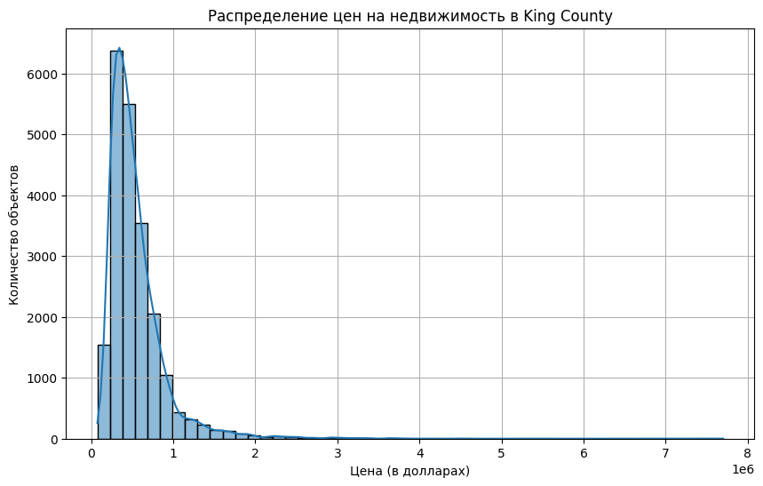

# Выводы по площади жилой недвижимости
1. Большинство домов имеет площадь до 4000 кв. футов.
2. Есть дома с очень большой площадью, что также указывает на элитные объекты недвижимости.

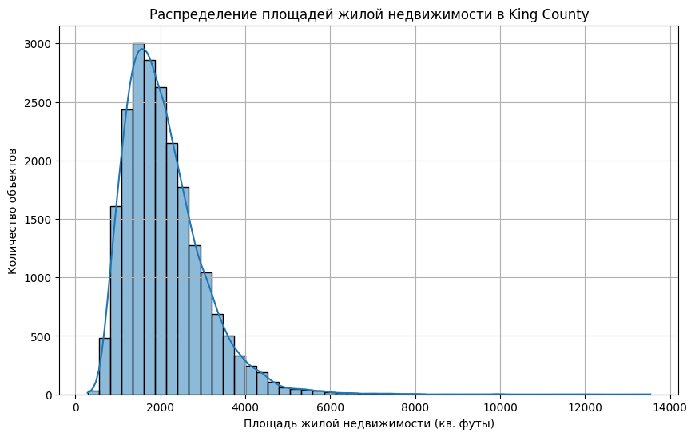

# Выводы по годам постройки
1. Большинство домов построено после 1950 года.
2. Есть некоторое количество домов, построенных в начале 20 века, что свидетельствует о наличии исторических объектов недвижимости.

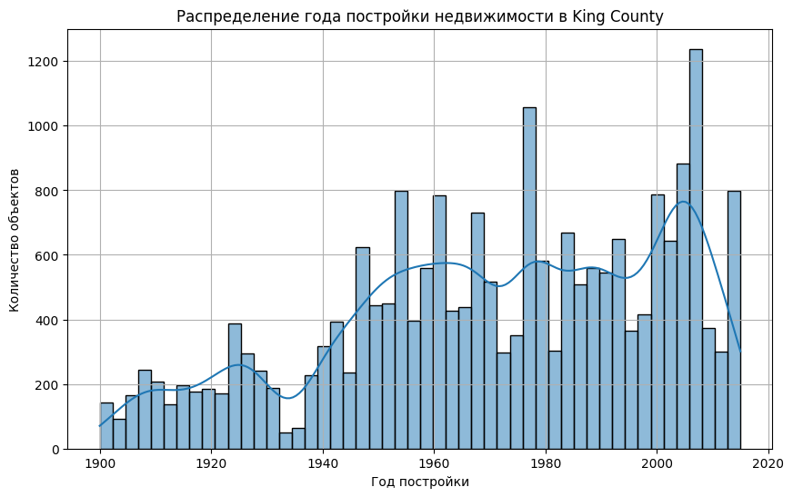

## Итоги
1. Цены на недвижимость в King County варьируются, с основной массой объектов в диапазоне до $1,000,000.
2. Площади домов также значительно варьируются, но большинство из них имеют площадь до 4000 кв. футов.
3. Годы постройки показывают, что значительное количество недвижимости было построено после 1950 года, что может говорить о развитии региона в это время.

# Изучение распределения домов от наличия вида на набережную
1. Большинство домов не имеет вида на набережную.
2. Небольшое количество домов расположено с видом на воду, что может указывать на премиальную стоимость таких объектов.

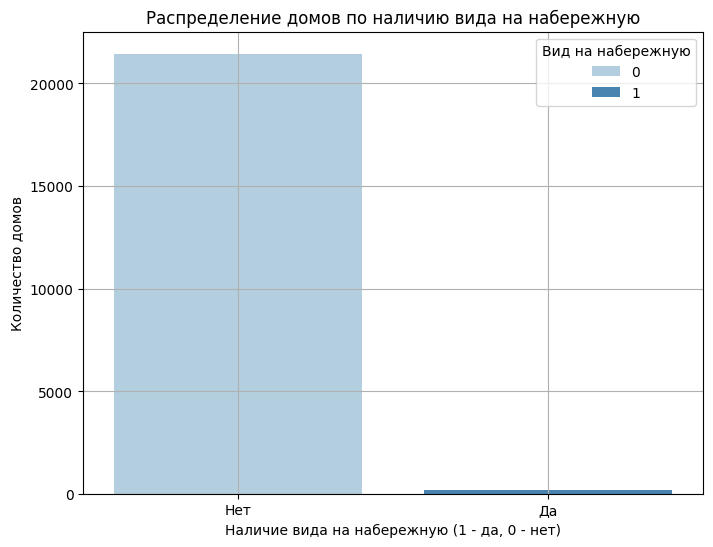

# Изучение распределения этажей домов
1. Основная масса домов имеет один или два этажа.
2. Меньше домов с большим количеством этажей, что может свидетельствовать о преобладании одно- и двухэтажной жилой застройки.

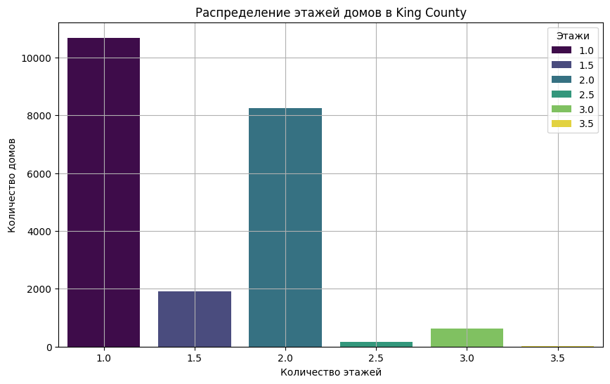

# Изучение распределения состояния домов
Проанализируем состояние домов. Оценка состояния варьируется от 1 (очень плохое состояние) до 5 (отличное состояние).

1. Большинство домов находятся в хорошем (оценка 3) или очень хорошем (оценка 4) состоянии.
2. Очень мало домов находятся в отличном состоянии или в состоянии, требующем капитального ремонта.

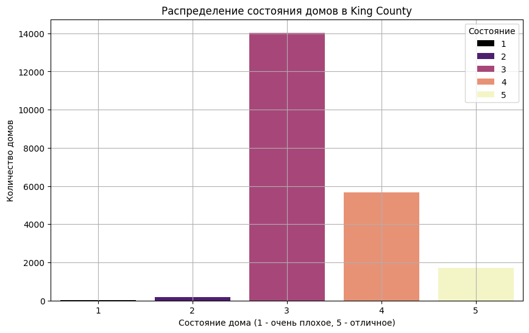

## Итоги

/ График(image-3.png): На графике видно, что значительное количество домов (порядка 98%) не имеют вида на набережную, и только небольшое количество (около 2%) имеют такой вид. Это говорит о том, что дома с видом на воду являются эксклюзивными и, вероятно, более дорогими./

// График(image-4.png): График показывает, что основная масса домов (около 85%) имеет один или два этажа. Дома с большим количеством этажей встречаются значительно реже, что указывает на их возможное использование для особых нужд или их более высокую стоимость.//

/// График(image-5.png): График показывает, что большая часть домов находится в удовлетворительном или хорошем состоянии. Это может свидетельствовать о том, что рынок недвижимости требует либо реконструкции, либо поддержания текущего состояния зданий.///

### Каждый из этих анализов дает полезное представление о текущем состоянии и особенностях рынка недвижимости в King County. Домов с видом на набережную мало, что делает их более эксклюзивными и, возможно, более дорогими. Большинство домов имеют один или два этажа, что соответствует стандартным жилым зданиям, а состояние большинства домов варьируется от удовлетворительного до хорошего, что может говорить о необходимости в поддержании или улучшении жилищного фонда.

# Исследование факторов, влияющих на стоимость недвижимости, является ключевым этапом анализа рынка. В этом разделе мы проанализируем, какие характеристики недвижимости оказывают влияние на ее стоимость, используя различные виды диаграмм. Рассмотрим пять характеристик:

### 1. Площадь жилой недвижимости.
### 2. Наличие вида на набережную.
### 3. Год постройки.
### 4. Количество этажей.
### 5. Состояние дома.

# 1. Площадь жилой недвижимости.

- График показывает, что существует прямая зависимость между площадью жилой недвижимости и ее стоимостью.
- Чем больше площадь дома, тем выше его стоимость. Однако есть значительные выбросы, указывающие на дома с очень высокой стоимостью, вероятно, из-за премиальных характеристик, таких как местоположение и дополнительные удобства.

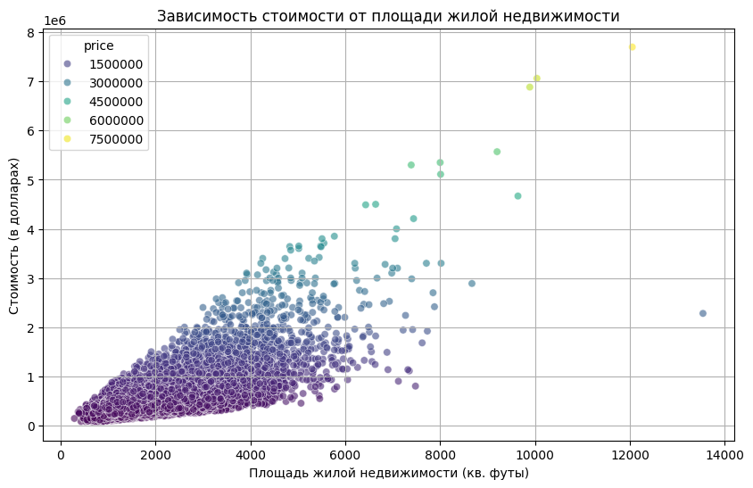

# 2. Наличие вида на набережную.

- График показывает, что дома с видом на набережную значительно дороже, чем дома без такого вида.
- Вид на набережную является важным фактором, влияющим на повышение стоимости недвижимости.

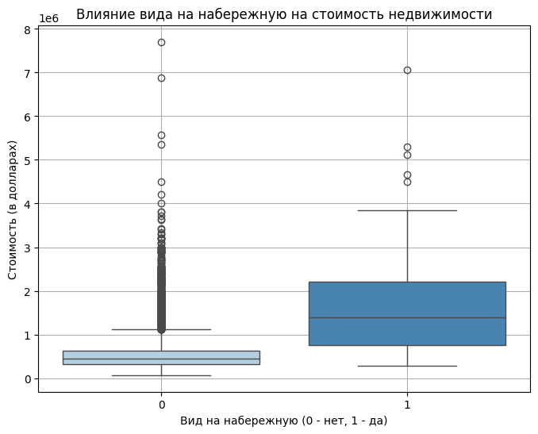

# 3. Год постройки.

- График показывает, что в среднем более новые дома имеют тенденцию к более высокой стоимости.
- Дома, построенные в последние десятилетия, стоят значительно дороже, что может быть связано с новыми строительными стандартами и требованиями рынка.

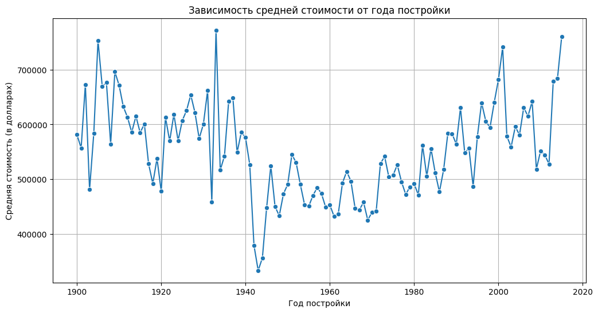

# 4. Количество этажей.

- График показывает, что дома с большим количеством этажей, в целом, имеют более высокую стоимость.
- Дома с двумя и более этажами часто оказываются дороже, что может быть связано с более высокой полезной площадью и дополнительными удобствами.

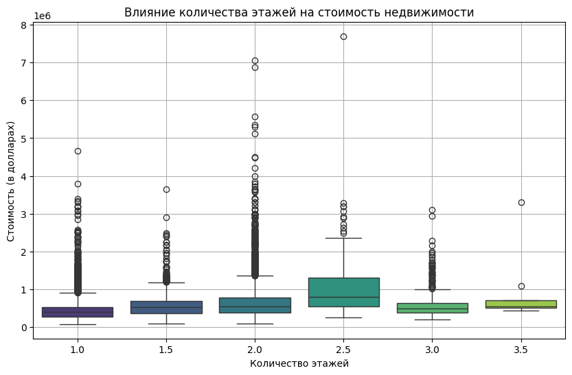

# 5. Состояние дома.

- График показывает, что дома в лучшем состоянии стоят дороже, чем дома в худшем состоянии.
- Состояние дома является важным фактором, влияющим на стоимость, и домовладельцы, как правило, платят больше за недвижимость в хорошем или отличном состоянии.

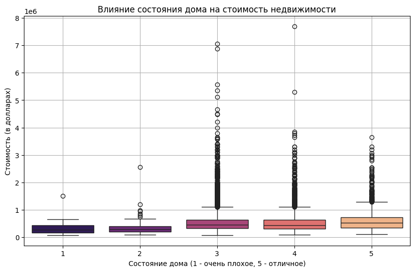

# Итоговые выводы
- Площадь жилой недвижимости является ключевым фактором, определяющим стоимость. Чем больше площадь, тем выше стоимость, что подтверждается положительной корреляцией.
- Наличие вида на набережную значительно увеличивает стоимость недвижимости. Это редкий и ценный атрибут, который повышает привлекательность и, следовательно, цену.
- Год постройки также оказывает влияние на стоимость: более новые дома стоят дороже, что может быть связано с новыми строительными стандартами и требованиями рынка.
- Количество этажей влияет на стоимость, при этом дома с большим количеством этажей чаще всего имеют более высокую стоимость из-за большей полезной площади и дополнительных удобств.
- Состояние дома является важным фактором: чем лучше состояние дома, тем выше его стоимость. Инвестирование в улучшение состояния недвижимости может привести к увеличению ее рыночной стоимости.
- Эти результаты подчеркивают важность рассмотрения различных факторов при оценке стоимости недвижимости и могут помочь потенциальным покупателям и инвесторам принимать обоснованные решения на рынке недвижимости.

